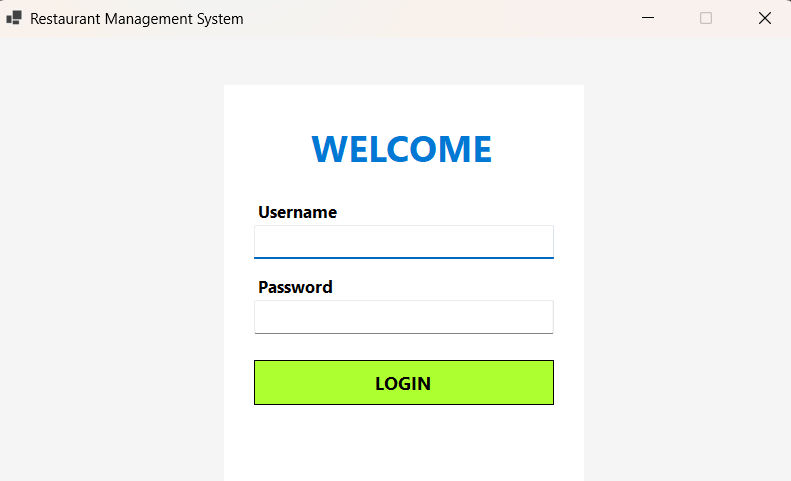
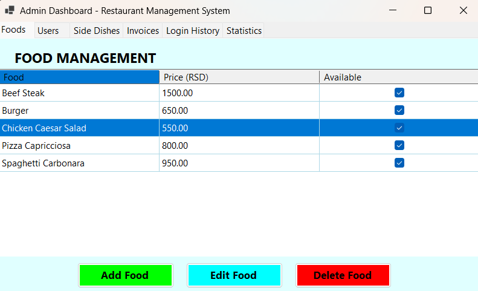
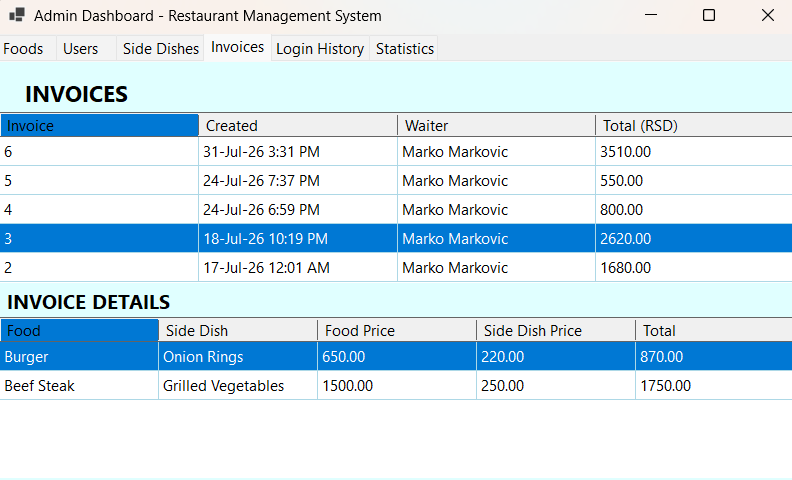
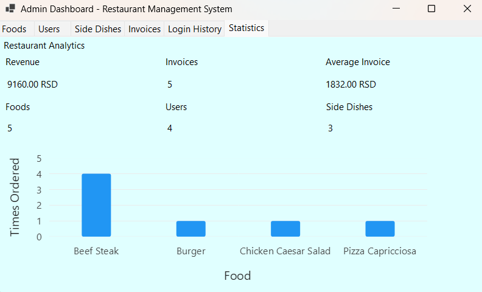
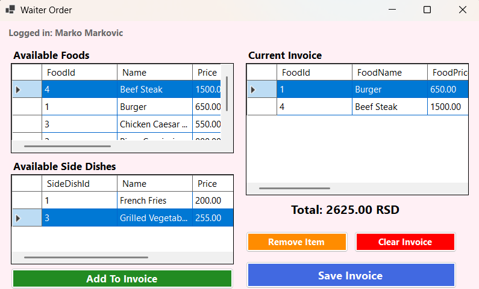
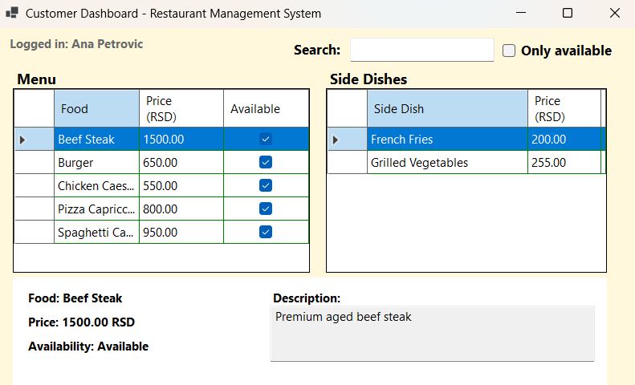

# Restaurant Management System

Desktop application developed in **C# WinForms (.NET 10)** for managing restaurant operations, including authentication, food and side dish management, invoice processing, login tracking, and business analytics.

---

## Overview

Restaurant Management System is a role-based desktop application designed to simulate the workflow of a small restaurant. The project demonstrates **WinForms UI development**, **ADO.NET database programming**, **SQL Server relational modeling**, and **data visualization using LiveCharts2**.

The application supports three different user roles:

* **Administrator** – manages foods, side dishes, users, invoices, login history, and analytics.
* **Waiter** – creates invoices by combining foods and side dishes.
* **Customer** – browses the menu, views detailed descriptions, searches items, and filters available products.

---

## Features

### Authentication

* Username and password login
* Role-based dashboard navigation
* Login history tracking for successful and failed attempts

---

### Administrator Dashboard

The administrator dashboard contains **6 management tabs**.

#### Foods

* View all foods
* Add food
* Edit food
* Delete food
* Availability management

#### Users

* View all users
* Add user
* Edit user
* Delete user
* Role and activity management

#### Side Dishes

* View all side dishes
* Add side dish
* Edit side dish
* Delete side dish

#### Invoices

* Invoice overview table
* Invoice details table
* Display waiter, total price, food items, and side dishes

#### Login History

* Username
* Login time
* Successful / unsuccessful login status

#### Statistics

Restaurant analytics cards displaying:

* Total revenue
* Number of invoices
* Average invoice value
* Number of foods
* Number of users
* Number of side dishes

Includes a **LiveCharts2 column chart** showing **top-selling foods** with dynamic axis scaling.

---

### Waiter Dashboard

The waiter dashboard provides a simplified billing workflow.

#### Available Foods

Displays:

* FoodId
* Name
* Price
* Description
* Availability status

#### Available Side Dishes

Displays:

* SideDishId
* Name
* Price
* Availability status

#### Current Invoice

* Add selected food and side dish combinations
* Remove invoice items
* Clear the current invoice
* Save the invoice to the database
* Automatic total calculation in **RSD**

---

### Customer Dashboard

The customer dashboard acts as a restaurant menu browser.

#### Menu Table

Displays:

* Food
* Price (RSD)
* Availability

#### Description Panel

Shows:

* Selected food name
* Price
* Availability
* Detailed description

#### Side Dishes Table

Displays available side dishes and prices.

#### Search & Filtering

* Search foods by name
* **Only Available** checkbox filter

---

## Technologies Used

| Technology             | Purpose                |
| ---------------------- | ---------------------- |
| **C#**                 | Application logic      |
| **.NET 10**            | WinForms framework     |
| **Windows Forms**      | Desktop user interface |
| **SQL Server LocalDB** | Relational database    |
| **ADO.NET**            | Database communication |
| **LiveCharts2**        | Data visualization     |
| **SkiaSharp**          | Chart rendering engine |

---

## Project Structure

```text
RestaurantManagementSystem
│
├── Database
│   ├── 01_Schema.sql
│   └── 02_SeedData.sql
│
├── Documentation
│
├── Enum
│   ├── InvoiceStatus.cs
│   └── UserRole.cs
│
├── Forms
│   ├── AddEditFoodForm.cs
│   ├── AddEditSideDishForm.cs
│   ├── AddEditUserForm.cs
│   ├── AdminDashboardForm.cs
│   ├── CustomerDashboardForm.cs
│   ├── LoginForm.cs
│   └── WaiterDashboardForm.cs
│
├── Models
│   ├── Food.cs
│   ├── FoodSaleStatistics.cs
│   ├── FoodSideDish.cs
│   ├── Invoice.cs
│   ├── InvoiceItem.cs
│   ├── InvoiceItemDetailsView.cs
│   ├── InvoiceItemView.cs
│   ├── InvoiceView.cs
│   ├── LoginHistory.cs
│   ├── SideDish.cs
│   ├── StatisticsView.cs
│   └── User.cs
│
├── Screenshots
│   ├── login.png
│   ├── admin-foods.png
│   ├── admin-invoices.png
│   ├── statistics.png
│   ├── waiter-dashboard.png
│   └── customer-dashboard.png
│
├── Services
│   ├── DatabaseService.cs
│   ├── FoodService.cs
│   ├── InvoiceService.cs
│   ├── LoginHistoryService.cs
│   ├── SideDishService.cs
│   ├── StatisticsService.cs
│   └── UserService.cs
│
└── Program.cs
```


---

## Database Setup

### 1. Open SQL Server Management Studio

Connect to:

```text
(localdb)\MSSQLLocalDB
```

### 2. Execute the schema script

Run:

```text
Database/01_Schema.sql
```

This script:

* creates the `RestaurantManagementDB` database,
* creates all required tables,
* configures primary keys, foreign keys, and constraints.

### 3. Insert demo data

Run:

```text
Database/02_SeedData.sql
```

This script inserts:

* demo users,
* sample foods,
* sample side dishes,
* food-side dish relationships,
* sample invoice data for statistics.

---

## Demo Accounts

| Role              | Username | Password      |
| ----------------- | -------- | ------------- |
| **Administrator** | `admin`  | `admin123`    |
| **Waiter**        | `marko`  | `waiter123`   |
| **Customer**      | `ana`    | `customer123` |

---

## Screenshots

### Login Form



### Administrator Dashboard – Foods



### Administrator Dashboard – Invoices



### Restaurant Analytics



### Waiter Dashboard



### Customer Dashboard



---

## Requirements

* **Visual Studio 2026**
* **.NET 10 SDK**
* **SQL Server LocalDB**
* Windows 10 or newer

---

## How to Run

### Clone the repository

```bash
git clone https://github.com/FilipDjukic00/RestaurantManagementSystem.git
```

### Open the solution

Open:

```text
RestaurantManagementSystem.sln
```

### Restore NuGet packages

Visual Studio will automatically restore required packages.

### Create the database

Execute:

```text
Database/01_Schema.sql
Database/02_SeedData.sql
```

### Run the application

Press:

```text
Ctrl + F5
```

---

## Architecture

The application follows a simple layered architecture:

### Presentation Layer

**Forms/**

* Handles user interaction
* Displays DataGridViews, forms, and charts
* Contains minimal business logic

### Business Logic Layer

**Services/**

* Performs CRUD operations
* Communicates with SQL Server through ADO.NET
* Encapsulates invoice processing and statistics calculations

### Domain Layer

**Models/**

* Represents application entities
* Transfers data between the database and UI layers

### Database Layer

**Database/**

* Contains schema creation scripts
* Provides demo data for quick project setup

This separation keeps the UI independent from database operations and improves maintainability.

---

## Known Limitations

This project was created as an **educational and portfolio application**.

For simplicity:

* user passwords are currently stored in plain text,
* authentication is intended for demonstration purposes,
* advanced security features (password hashing, authorization middleware, encrypted configuration) are planned as future improvements.

---

## What I Learned

Through this project I practiced:

* WinForms application architecture
* ADO.NET database programming
* SQL Server relational database design
* CRUD operations and data validation
* Event-driven programming
* Role-based authorization
* Invoice processing workflows
* Data visualization using LiveCharts2
* UI consistency and dashboard organization
* Separation of concerns using **Forms, Services, and Models**

---

## Future Improvements

Possible future enhancements:

* Password hashing with BCrypt
* Table reservation system
* Invoice export to PDF
* Advanced search and filtering
* Monthly / yearly revenue reports
* Dark mode support
* Unit tests for the service layer
* Improved responsive layout for larger screens

---

## Author

**FilipDjukic00**

This project was developed as a **portfolio project for junior .NET developer positions**, with a focus on **C#, WinForms, SQL Server, ADO.NET, and desktop business application development**.
